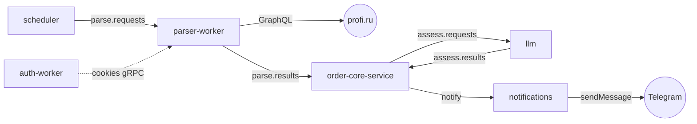

# profi-notifications

Конвейер, который по расписанию собирает доску заказов [profi.ru](https://profi.ru),
прогоняет каждый заказ через LLM-оценку по профилю исполнителя и присылает
подходящие в заданный топик Telegram.

Система собрана из независимых сервисов на разных языках, связанных через
**RabbitMQ**. Каждый сервис делает одну вещь, разрабатывается по Clean Architecture
и держит свой контракт очередей.

## Как это работает



1. **scheduler** каждые N секунд кладёт команду парсинга в очередь `parse.requests`.
2. **parser-worker** берёт команду, забирает свежие cookies у **auth-worker** по gRPC,
   тянет доску profi.ru через GraphQL и публикует батч заказов в `parse.results`.
3. **order-core-service** («core») дедуплицирует заказы, сохраняет их в PostgreSQL и
   через Outbox отправляет каждый новый заказ на оценку в `assess.requests`.
4. **llm** оценивает заказ по профилю исполнителя, и для подходящих кладёт вердикт с
   готовым Telegram-уведомлением в `assess.results`.
5. **order-core-service** принимает вердикт, решает — слать ли уведомление — и через
   Outbox публикует его в обменник `notifications`.
6. **notifications** доставляет сообщение в Telegram-канал или топик.

## Сервисы

| Сервис | Стек | Роль |
|---|---|---|
| [`scheduler`](scheduler/) | Python · FastStream · Taskiq | Триггер: по расписанию кладёт команду парсинга в `parse.requests` |
| [`auth-worker`](auth-worker/) | Go · gRPC | Держит cookies авторизации profi.ru свежими, отдаёт их по gRPC |
| [`parser-worker`](parser-worker/) | Rust · lapin · tonic · reqwest | Парсит доску profi.ru через GraphQL, публикует заказы в `parse.results` |
| [`order-core-service`](order-core-service/) | Python · FastStream · SQLAlchemy · PostgreSQL | «Core»: дедуп, хранение, оркестрация оценки и уведомлений через Outbox |
| [`llm`](llm/) | Python · FastStream · LangChain | Оценивает заказ по профилю исполнителя через LLM (DeepInfra) |
| [`notifications`](notifications/) | Bun · TypeScript | Доставляет готовые уведомления в Telegram-канал или топик |

Инфраструктура: **RabbitMQ** — шина между сервисами; **PostgreSQL** — состояние «core»
(заявки, статусы, Outbox).

## Карта очередей

Всё общение между сервисами идёт через RabbitMQ. Основные рёбра:

| Очередь / обменник | Продюсер | Консюмер | Полезная нагрузка |
|---|---|---|---|
| `parse.requests` | scheduler | parser-worker | Команда парсинга (`ParseRequest`) |
| `parse.results` | parser-worker | order-core-service | Батч заказов (`ParseResult`) |
| `assess.requests` | order-core-service | llm | Заказ на оценку |
| `assess.results` | llm | order-core-service | Вердикт + готовое уведомление |
| `notifications` (обменник, routing key `notify`) | order-core-service | notifications | Telegram-сообщение |

У `order-core-service`, `llm` и `notifications` есть ещё собственные retry- и
dead-letter-очереди для надёжной обработки — детали в README каждого сервиса.

## Быстрый старт

Нужен установленный Docker.

1. Создай файл настроек из шаблона:
   ```bash
   cp .env.example .env
   ```
   Как минимум задай `LLM__API_KEY` (токен [DeepInfra](https://deepinfra.com)),
   `TELEGRAM_BOT_TOKEN` и `TELEGRAM_CHAT_ID`. Смени `RABBITMQ_PASS` и `POSTGRES_PASS`
   с `change-me` на свои.
2. Положи свежие cookies profi.ru в `auth-worker/data/cookies.json`
   ([экспорт из браузера](https://chromewebstore.google.com/detail/j2team-cookies/okpidcojinmlaakglciglbpcpajaibco)
   после входа в аккаунт).
3. Подними весь конвейер:
   ```bash
   docker compose up -d
   ```
4. Проверь, что контейнеры поднялись (`STATUS` должен стать `healthy`):
   ```bash
   docker compose ps
   ```
5. Смотри логи ключевых сервисов:
   ```bash
   docker compose logs -f order-core-service llm notifications
   ```

Остановить: `docker compose down`.

Первые уведомления придут не сразу: сначала scheduler опубликует команду
(по умолчанию раз в 5 минут), парсер соберёт доску, а «core» и llm обработают заказы.
Миграции БД накатываются автоматически при старте `order-core-service`.

## Конфигурация

Весь стек читает настройки из одного `.env` в корне (см. [`.env.example`](.env.example)).
Docker Compose пробрасывает их в контейнеры и связывает сервисы между собой — адреса
RabbitMQ и PostgreSQL подставляются автоматически, вручную их задавать не нужно.

Самое важное:

| Переменная | Назначение |
|---|---|
| `LLM__API_KEY` | Токен DeepInfra — обязателен, без него `llm` не стартует |
| `LLM__MODEL` | Модель оценки (по умолчанию `Qwen/Qwen3-32B`) |
| `TELEGRAM_BOT_TOKEN` | Токен бота от [@BotFather](https://t.me/BotFather) |
| `TELEGRAM_CHAT_ID` | Канал (`@username`/`-100…`) или супергруппа-получатель |
| `TELEGRAM_MESSAGE_THREAD_ID` | Топик форума по умолчанию (опционально) |
| `SCHEDULER__PARSE_INTERVAL_SECONDS` | Как часто парсить доску (по умолчанию `300`) |
| `ASSESSMENT__SUITABILITY_THRESHOLD` | Порог оценки в `llm` (0–100) |
| `ASSESSMENT__NOTIFY_THRESHOLD` | Порог «core» поверх `llm` (`0` = доверять `llm`) |

Полный список — в [`.env.example`](.env.example) и в README каждого сервиса.

## Health и метрики

Из хоста доступны только два сервиса — остальные общаются внутри compose-сети и
проверяют себя контейнерным healthcheck'ом (статус виден в `docker compose ps`):

| Сервис | Адрес | Эндпоинты |
|---|---|---|
| order-core-service | `http://127.0.0.1:8001` | `/health`, `/ready` |
| notifications | `http://127.0.0.1:3000` | `/health`, `/ready`, `/metrics` |

RabbitMQ и PostgreSQL порты наружу не публикуют.

## Разработка

Правила ветвления, коммитов и Pull Request'ов:
- **Ветки:** `feature/...`, `bugfix/...`, `refactor/...` — строчными, слова через дефис.
- **Коммиты:** `тип: описание` на русском (`feature:`, `fix:`, `docs:`), одна логическая
  правка — один коммит.
- **PR:** на русском, по шаблону [`.github/PULL_REQUEST_TEMPLATE.md`](.github/PULL_REQUEST_TEMPLATE.md).

Каждый сервис самодостаточен. Тулчейн по языкам:

- Python (`llm`, `order-core-service`, `scheduler`) — `uv`, `ruff`, `mypy`, `pytest`.
- Rust (`parser-worker`) — `cargo`.
- Go (`auth-worker`) — `go test`, `go vet`, `gofmt`.
- TypeScript (`notifications`) — `bun`.

Хуки настроены через [`prek`](prek.toml) (trailing whitespace, gitleaks, `go fmt/vet/test`
и др.) и гоняются на каждом коммите.

## Структура репозитория

```
.
├── scheduler/            триггер парсинга по расписанию (Python)
├── auth-worker/          cookies profi.ru по gRPC (Go)
├── parser-worker/        парсер доски profi.ru (Rust)
├── order-core-service/   «core»: дедуп, PostgreSQL, Outbox (Python)
├── llm/                  LLM-оценка заказов (Python)
├── notifications/        доставка в Telegram (Bun / TypeScript)
├── docker-compose.yml    весь конвейер одной командой
└── .env.example          единая конфигурация стека
```
